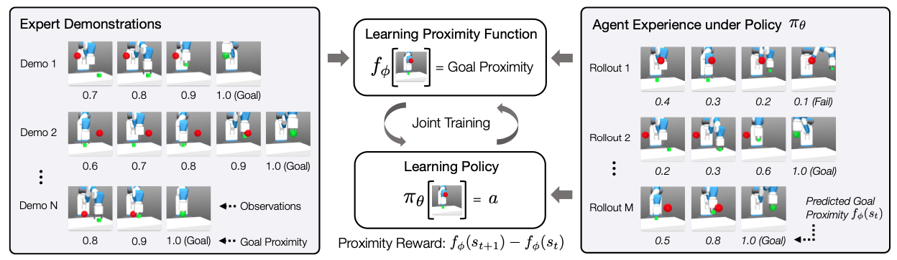

# Generalizable Imitation Learning from Observation via Inferring Goal Proximity
#### [[Paper]](https://openreview.net/pdf?id=lp9foO8AFoD)
[Youngwoon Lee^*](https://youngwoon.github.io/)<sup>1</sup>, 
[Andrew Szot^*](https://www.andrewszot.com)<sup>2</sup>, 
[Shao-Hua Sun](https://www.andrewszot.com)<sup>1</sup>, 
[Joseph Lim](https://www.clvrai.com/)<sup>1</sup>

<sup>1</sup>CLVR Lab, University of Southern California 
<sup>2</sup>Georgia Institute of Technology

<p align="center">

</img>
</p>

This is the official PyTorch implementation of the paper "**Accelerating Reinforcement Learning with Learned Skill Priors**"
(CoRL 2020).


## Installation
1. This code base requires `Python 3.7` or higher. All package requirements are in
`requirements.txt`. To install from scratch using [Anaconda](download minconda), use the following
commands.

```
conda create -n [your_env_name] python=3.7
source activate [your_env_name]
pip install -r requirements.txt

cd d4rl
pip install -e .
cd ../rl-toolkit
pip install -e .

wandb login <YOUR_API_KEY>
```

2. Download expert demonstration datasets to `./expert_datasets`. We include the expert demonstration datasets on [Google Drive](https://drive.google.com/drive/folders/1Z9N7fTYb3uul-lgTC_zlJrMaDAkYYJdR?usp=sharing) and provide a script for downloading them.
```
python download_demos.py
```


## How to reproduce experiments

By default, the commands are for the demonstrations covering 100% of the states or with the default noise.
For all of the experiments, you can specify the random seed with `--seed`.

### Navigation

- Ours: `python goal_prox/main.py --prefix dpf --linear-lr-decay True --env-name "MiniGrid-FourRooms-v0" --alg dpf --traj-batch-size 32 --num-env-steps 5e6 --pf-uncert-scale 0.1 --traj-load-path ./expert_datasets/nav_100.pt --action-input False --traj-frac 0.25 --pf-reward-norm True`
- GAIfO-s: `python goal_prox/main.py --prefix gail --linear-lr-decay True --env-name "MiniGrid-FourRooms-v0" --alg gail --num-env-steps 5e6 --disc-lr 0.0001 --action-input False --traj-load-path ./expert_datasets/nav_100.pt --traj-frac 0.25`
- GAIfO: `python goal_prox/main.py --prefix gaifo --linear-lr-decay True --env-name "MiniGrid-FourRooms-v0" --alg gaifo --num-env-steps 5e6 --disc-lr 0.001 --traj-load-path ./expert_datasets/nav_100.pt --traj-frac 0.25`
- BCO: `python goal_prox/main.py --prefix bco --linear-lr-decay True --env-name "MiniGrid-FourRooms-v0" --alg bco  --max-grad-norm -1 --lr 0.0001 --bco-expl-steps 10000 --bco-inv-lr 0.0001 --bco-inv-epochs 1 --bco-inv-eval-holdout 0.1 --bco-inv-batch-size 32 --bc-num-epochs 1 --bco-alpha 500 --bco-alpha-size 10000 --traj-batch-size 32 --num-processes 32 --eval-num-processes 32 --traj-load-path ./expert_datasets/nav_100.pt --traj-frac 0.25`
- BC: `python goal_prox/main.py --prefix bc --linear-lr-decay True --env-name "MiniGrid-FourRooms-v0" --alg bc --num-env-steps 5e6 --traj-load-path ./expert_datasets/nav_100.pt --traj-frac 0.25  --bc-num-epochs 1000 --lr 0.0001 --eval-num-processes 32  --max-grad-norm -1  --traj-val-ratio 0.2 --traj-batch-size 64`
- GAIL: `python goal_prox/main.py --prefix gail --linear-lr-decay True --env-name "MiniGrid-FourRooms-v0" --alg gail --num-env-steps 5e6 --disc-lr 0.0001 --traj-load-path ./expert_datasets/nav_100.pt --traj-frac 0.25 --action-input True   --gail-reward-norm True`
- SQIL: `python pytorch_sac/train.py env="MiniGrid-FourRooms-v0"  expertpath=./expert_datasets/nav_100.pt expertfrac=0.25 agent.params.trunk_type='gw_cnn' agent.class="agent.sql.SQLAgent" double_q_critic.class="agent.critic.QNetwork" agent.params.init_temperature=0.25`

For running holdout experiments specify the following additional arguments:
- 100%: `--traj-load-path ./expert_datasets/nav_100.pt`
- 75%: `--traj-load-path ./expert_datasets/nav_75.pt`
- 50%: `--traj-load-path ./expert_datasets/nav_50.pt`
- 25%: `--traj-load-path ./expert_datasets/nav_25.pt`


### Maze2D
- Ours: `python goal_prox/main.py --use-proper-time-limits --linear-lr-decay True --num-env-steps 5e6 --num-mini-batch 32 --num-epochs 10 --pf-reward-norm True --lr 3e-4 --alg dpf-deep --prefix dpf-deep --env-name maze2d-medium-v2 --exp-succ-scale 1 --entropy-coef 0.0001 --exp-sample-size 4096 --exp-buff-size 4096 --pf-uncert-scale 0.01 --pf-reward-scale 1.0 --cuda False --traj-load-path ./expert_datasets/maze2d_100.pt`
- GAIFO-s: `python goal_prox/main.py --prefix gail-s-deep --use-proper-time-limits --linear-lr-decay True --lr 3e-4 --num-env-steps 5e6 --alg gail-deep --disc-lr 0.0001 --num-mini-batch 32 --num-epochs 10 --entropy-coef 0.0001 --action-input False --env-name maze2d-medium-v2 --gail-reward-norm False --cuda False --traj-load-path ./expert_datasets/maze2d_100.pt`
- GAIFO: `python goal_prox/main.py --prefix gaifo-deep --use-proper-time-limits --linear-lr-decay True --lr 3e-4 --num-env-steps 5e6 --alg gaifo-deep --num-mini-batch 32 --num-epochs 10 --entropy-coef 0.0001 --action-input False --disc-lr 0.001 --gail-reward-norm False --cuda False --reward-type gaifo --env-name maze2d-medium-v2 --traj-load-path ./expert_datasets/maze2d_100.pt`
- BCO: `python goal_prox/main.py --prefix bco --linear-lr-decay True --alg bco --eval-num-processes 8 --cuda False --bc-state-norm False --max-grad-norm -1 --normalize-env False --lr 0.0005 --bc-num-epochs 1 --bco-expl-steps 10000 --bco-inv-lr 0.0001 --bco-inv-epochs 5 --bco-alpha 1000 --bco-alpha-size 10000 --num-processes 32 --log-interval 1 --env-name maze2d-medium-v2 --traj-load-path ./expert_datasets/maze2d_100.pt`
- BC: `python goal_prox/main.py --prefix bc --use-proper-time-limits --linear-lr-decay True --num-env-steps 5e6 --alg bc --il-out-action-norm --il-in-action-norm --traj-load-path ./expert_datasets/maze2d_100.pt --env-name maze2d-medium-v2 --normalize-env False --lr 0.001 --bc-num-epochs 1000 --eval-num-processes 9 --traj-val-ratio 0.2 --cuda False`
- GAIL: `python goal_prox/main.py --prefix gail-deep --use-proper-time-limits --linear-lr-decay True --lr 3e-4 --num-env-steps 5e6 --alg gail-deep --disc-lr 0.0001 --num-mini-batch 32 --num-epochs 10 --entropy-coef 0.0001 --action-input True --env-name maze2d-medium-v2 --gail-reward-norm False --cuda False --traj-load-path ./expert_datasets/maze2d_100.pt`
- SQIL: `python pytorch_sac/train.py env=maze2d-medium-v2 expertfrac=1.0 num_train_steps=5e6 agent.params.linear_lr_decay=False expertpath=./expert_datasets/maze2d_100.pt`
- GoalGAIL: `python goal_prox/main.py --prefix goal-gail --alg goal-gail --use-proper-time-limits --linear-lr-decay False --lr 0.0003 --num-env-steps 5e6 --trans-buffer-size 1000000 --update-every 100 --updates-per-batch 50 --rnd-prob 0.3 --disc-lr 0.0001 --gail-state-norm False --cuda False --reward-type gail --env-name maze2d-medium-v2 --traj-load-path ./expert_datasets/maze2d_100.pt --normalize-env False`

For running holdout experiments specify the following additional arguments:
- 100%: `--traj-load-path ./expert_datasets/maze2d_100.pt`
- 75%: `--traj-load-path ./expert_datasets/maze2d_75.pt`
- 50%: `--traj-load-path ./expert_datasets/maze2d_50.pt`
- 25%: `--traj-load-path ./expert_datasets/maze2d_25.pt`


### Ant Reach

- Ours: `python goal_prox/main.py --prefix ant-ours --num-env-steps 5e6 --linear-lr-decay True --lr 3e-4 --alg dpf-deep --traj-load-path ./expert_datasets/ant_50.pt --env-name AntGoal-v0 --pf-uncert-scale 0.01 --num-steps 500 --pf-reward-scale 1.0 --traj-frac 0.5 --entropy-coef 0.001 --num-mini-batch 32 --num-epochs 10 --prox-lr 0.0001 --pf-reward-norm True`
- GAIFO-s: `python goal_prox/main.py --prefix ant-gaifo-s --linear-lr-decay True --lr 3e-4 --num-env-steps 5e6 --alg gail-deep --env-name AntGoal-v0 --traj-load-path ./expert_datasets/ant_50.pt --num-steps 500 --traj-frac 0.5 --entropy-coef 0.001 --num-mini-batch 32 --num-epochs 10 --il-in-action-norm --il-out-action-norm`
- GAIFO: `python goal_prox/main.py --prefix ant-gaifo --linear-lr-decay True --lr 3e-4 --num-env-steps 5e6 --alg gaifo-deep --traj-load-path ./expert_datasets/ant_50.pt --env-name AntGoal-v0 --num-steps 500 --traj-frac 0.5 --entropy-coef 0.001 --num-mini-batch 32 --num-epochs 10 --il-in-action-norm --il-out-action-norm`
- BCO: `python goal_prox/main.py --prefix ant-bco --linear-lr-decay True --env-name AntGoal-v0 --alg bco --max-grad-norm -1 --lr 0.0001 --traj-load-path ./expert_datasets/ant_50.pt --bco-expl-steps 10000 --bco-inv-lr 0.0001 --traj-frac 0.5 --bco-inv-epochs 1 --bco-inv-batch-size 32 --bc-num-epochs 1 --bco-alpha 500 --bco-alpha-size 10000 --traj-batch-size 32 --eval-num-processes 32 --num-processes 32`
- BC: `python goal_prox/main.py --prefix bc --use-proper-time-limits --linear-lr-decay True --lr 0.001 --num-env-steps 5e6 --alg bc --env-name AntGoal-v0 --normalize-env False  --il-in-action-norm --il-out-action-norm --traj-load-path ./expert_datasets/ant_50.pt --bc-num-epochs 1000 --eval-num-processes 20 --ant-noise 0.0 --traj-frac 0.5 --traj-val-ratio 0.2`
- GAIL `python goal_prox/main.py --prefix ant-gaifo-s-0 --linear-lr-decay True --lr 3e-4 --num-env-steps 5e6 --alg gail-deep --env-name AntGoal-v0 --traj-load-path ./expert_datasets/ant_50.pt --cuda False --render-metric --num-steps 500 --traj-frac 0.5 --ant-noise 0.0  --action-input True --num-epochs 10 --num-mini-batch 32 --use-proper-time-limits --il-in-action-norm --il-out-action-norm --gail-reward-norm True  --entropy-coef 0.001 --disc-lr 0.0001`
- SQIL: `python pytorch_sac/train.py env=AntGoal-v0 expertpath=../expert_datasets/ant_50.pt expertfrac=0.5 env_noise=0.0`
- GoalGAIL: `python goal_prox/main.py --prefix goal-gail --alg goal-gail --use-proper-time-limits --linear-lr-decay False --lr 3e-4 --num-env-steps 5e6 --trans-buffer-size 1000000 --update-every 100 --updates-per-batch 50 --rnd-prob 0.3 --disc-lr 0.0001 --gail-state-norm False --cuda False --reward-type gail --env-name AntGoal-v0 --traj-load-path ./expert_datasets/ant_50.pt`

For running added noise experiments specify the following additional arguments:
- Noise 0.00: `--ant-noise 0.00`
- Noise 0.01: `--ant-noise 0.01`
- Noise 0.03: `--ant-noise 0.03`
- Noise 0.05: `--ant-noise 0.05`


### Fetch Push

- Ours: `python goal_prox/main.py --use-proper-time-limits --linear-lr-decay True --lr 3e-4 --num-env-steps 5e6 --num-mini-batch 32 --num-epochs 10 --pf-reward-norm True --alg dpf-deep --prefix dpf-deep --env-name FetchPushEnvCustom-v0 --exp-succ-scale 1 --il-in-action-norm --il-out-action-norm --exp-sample-size 4096 --exp-buff-size 4096 --pf-uncert-scale 0.001 --entropy-coef 0.001 --pf-reward-scale 1.0 --cuda False --traj-load-path ./expert_datasets/push_partial2.pt --fetch-easy-obs`
- GAIfO-s: `python goal_prox/main.py --use-proper-time-limits --linear-lr-decay True --lr 3e-4 --num-env-steps 5e6 --alg gail-deep --prefix gail-deep --env-name FetchPushEnvCustom-v0 --il-out-action-norm --il-in-action-norm --num-mini-batch 32 --num-epochs 10 --disc-lr 0.0001 --entropy-coef 0.001 --action-input False --gail-reward-norm True --cuda False --traj-load-path ./expert_datasets/push_partial2.pt --fetch-easy-obs`
- GAIfO: `python goal_prox/main.py --use-proper-time-limits --linear-lr-decay True --lr 3e-4 --num-env-steps 5e6 --prefix gaifo-deep --alg gaifo-deep --env-name FetchPushEnvCustom-v0 --il-out-action-norm --il-in-action-norm --num-mini-batch 32 --num-epochs 10 --disc-lr 0.0001 --entropy-coef 0.001 --action-input False --gail-reward-norm True --cuda False --traj-load-path ./expert_datasets/push_partial2.pt --fetch-easy-obs`
- BCO: `python goal_prox/main.py --use-proper-time-limits --linear-lr-decay True --lr 0.0005 --prefix bco --alg bco --env-name FetchPushEnvCustom-v0 --log-interval 1 --eval-num-processes 32 --num-processes 32 --bc-state-norm True --max-grad-norm -1 --normalize-env False --bc-num-epochs 1 --bco-expl-steps 10000 --bco-inv-lr 0.0001 --bco-inv-epochs 1 --bco-alpha 500 --bco-alpha-size 10000 --traj-load-path ./expert_datasets/push_partial2.pt --fetch-easy-obs`
- BC: `python goal_prox/main.py --use-proper-time-limits --linear-lr-decay True --lr 0.001 --num-env-steps 5e6 --prefix bc --alg bc --env-name FetchPushEnvCustom-v0 --eval-num-processes 20 --il-out-action-norm --il-in-action-norm --traj-val-ratio 0.2 --traj-load-path ./expert_datasets/push_partial2.pt --fetch-easy-obs --normalize-env False --bc-num-epochs 1000`
- GAIL: `python goal_prox/main.py --use-proper-time-limits --linear-lr-decay True --lr 3e-4 --num-env-steps 5e6 --alg gail-deep --prefix gail-deep --env-name FetchPushEnvCustom-v0 --il-out-action-norm --il-in-action-norm --num-mini-batch 32 --num-epochs 10 --disc-lr 0.0001 --entropy-coef 0.001 --action-input True --gail-reward-norm True --cuda False --traj-load-path ./expert_datasets/push_partial2.pt --fetch-easy-obs`
- SQIL: `python pytorch_sac/train.py env=FetchPushEnvCustom-v0 expertpath=./expert_datasets/push_partial2.pt expertfrac=1.0 env_noise=1.00`
- GoalGAIL: `python goal_prox/main.py --prefix goal-gail --alg goal-gail --use-proper-time-limits --linear-lr-decay False --lr 0.0003 --num-env-steps 5e6 --trans-buffer-size 1000000 --update-every 100 --updates-per-batch 50 --rnd-prob 0.3 --disc-lr 0.0001 --gail-state-norm False --cuda False --reward-type gail --env-name FetchPushEnvCustom-v0 --fetch-easy-obs --traj-load-path ./expert_datasets/push_partial2.pt --normalize-env False`

For running added noise experiments specify the following additional arguments:
- 1.0x: `--noise-ratio 1.0 --goal-noise-ratio 1.0` or `env_noise=1.0` for SQIL
- 1.25x: `--noise-ratio 1.25 --goal-noise-ratio 1.25` or `env_noise=1.25` for SQIL
- 1.75x: `--noise-ratio 1.75 --goal-noise-ratio 1.75` or `env_noise=1.75` for SQIL
- 2.0x: `--noise-ratio 2.0 --goal-noise-ratio 2.0` or `env_noise=2.0` for SQIL


### Fetch Pick

- Ours: `python goal_prox/main.py --use-proper-time-limits --linear-lr-decay True --lr 3e-4 --num-env-steps 5e6 --num-mini-batch 32 --num-epochs 10 --pf-reward-norm True --alg dpf-deep --prefix dpf-deep --env-name FetchPickAndPlaceDiffHoldout-v0 --exp-succ-scale 1 --il-in-action-norm --il-out-action-norm --exp-sample-size 4096 --exp-buff-size 4096 --pf-uncert-scale 0.001 --entropy-coef 0.001 --pf-reward-scale 1.0 --cuda False --traj-load-path ./expert_datasets/pick_partial3.pt --fetch-easy-obs`
- GAIfO-s: `python goal_prox/main.py --use-proper-time-limits --linear-lr-decay True --lr 3e-4 --num-env-steps 5e6 --alg gail-deep --prefix gail-deep --env-name FetchPickAndPlaceDiffHoldout-v0 --il-out-action-norm --il-in-action-norm --num-mini-batch 32 --num-epochs 10 --disc-lr 0.0001 --entropy-coef 0.001 --action-input False --gail-reward-norm True --cuda False --traj-load-path ./expert_datasets/pick_partial3.pt --fetch-easy-obs`
- GAIfO: `python goal_prox/main.py --use-proper-time-limits --linear-lr-decay True --lr 3e-4 --num-env-steps 5e6 --prefix gaifo-deep --alg gaifo-deep --env-name FetchPickAndPlaceDiffHoldout-v0 --il-out-action-norm --il-in-action-norm --num-mini-batch 32 --num-epochs 10 --disc-lr 0.0001 --entropy-coef 0.001 --action-input False --gail-reward-norm True --cuda False --traj-load-path ./expert_datasets/pick_partial3.pt --fetch-easy-obs`
- BCO: `python goal_prox/main.py --use-proper-time-limits --linear-lr-decay True --lr 0.0005 --prefix bco --alg bco --env-name FetchPickAndPlaceDiffHoldout-v0 --log-interval 1 --eval-num-processes 32 --num-processes 32 --bc-state-norm True --max-grad-norm -1 --normalize-env False --bc-num-epochs 1 --bco-expl-steps 10000 --bco-inv-lr 0.0001 --bco-inv-epochs 1 --bco-alpha 500 --bco-alpha-size 10000 --traj-load-path ./expert_datasets/pick_partial3.pt --fetch-easy-obs`
- BC: `python goal_prox/main.py --use-proper-time-limits --linear-lr-decay True --lr 0.001 --num-env-steps 5e6 --prefix bc --alg bc --env-name FetchPickAndPlaceDiffHoldout-v0 --eval-num-processes 20 --il-out-action-norm --il-in-action-norm --traj-val-ratio 0.2 --traj-load-path ./expert_datasets/pick_partial3.pt --fetch-easy-obs --normalize-env False --bc-num-epochs 1000`
- GAIL: `python goal_prox/main.py --use-proper-time-limits --linear-lr-decay True --lr 3e-4 --num-env-steps 5e6 --alg gail-deep --prefix gail-deep --env-name FetchPickAndPlaceDiffHoldout-v0 --il-out-action-norm --il-in-action-norm --num-mini-batch 32 --num-epochs 10 --disc-lr 0.0001 --entropy-coef 0.001 --action-input True --gail-reward-norm True --cuda False --traj-load-path ./expert_datasets/pick_partial3.pt --fetch-easy-obs`
- SQIL `python pytorch_sac/train.py env=FetchPickAndPlaceDiffHoldout-v0 expertpath=./expert_datasets/pick_partial3.pt expertfrac=1.0 env_noise=1.00`
- GoalGAIL: `python goal_prox/main.py --use-proper-time-limits --linear-lr-decay False --lr 0.0003 --num-env-steps 5e6 --prefix goal-gail --alg goal-gail --env-name FetchPickAndPlaceDiffHoldout-v0 --trans-buffer-size 1000000 --update-every 100 --updates-per-batch 50 --rnd-prob 0.3 --disc-lr 0.0001 --gail-state-norm False --cuda False --reward-type gail --fetch-easy-obs --traj-load-path ./expert_datasets/pick_partial3.pt --normalize-env False`

For running added noise experiments specify the following additional arguments:
- 1.0x: `--noise-ratio 1.0 --goal-noise-ratio 1.0` or `env_noise=1.0` for SQIL
- 1.25x: `--noise-ratio 1.25 --goal-noise-ratio 1.25` or `env_noise=1.25` for SQIL
- 1.75x: `--noise-ratio 1.75 --goal-noise-ratio 1.75` or `env_noise=1.75` for SQIL
- 2.0x: `--noise-ratio 2.0 --goal-noise-ratio 2.0` or `env_noise=2.0` for SQIL


### Hand Rotate

- Ours-GAIL: `python goal_prox/main.py --use-proper-time-limits --linear-lr-decay True --num-env-steps 5e6  --cuda False --render-metric --num-mini-batch 32 --num-epochs 10 --pf-reward-norm True --lr 3e-4 --alg dpf-deep --prefix dpf-deep --env-name CustomHandManipulateBlockRotateZ-v0 --exp-sample-size 4096 --exp-buff-size 4096 --prox-lr 0.0001 --hand-inc-goal --hand-dense --hand-end-on-succ --hand-easy --traj-load-path ./expert_datasets/hand_10000.pt --entropy-coef 0.0001 --pf-uncert-scale 0.01 --pf-reward-scale 1.0 --pf-reward-type airl --noise-ratio 1.0`
- Ours: `python goal_prox/main.py --use-proper-time-limits --linear-lr-decay True --num-env-steps 5e6  --cuda False --render-metric --num-mini-batch 32 --num-epochs 10 --pf-reward-norm True --lr 3e-4 --alg dpf-deep --prefix dpf-deep --env-name CustomHandManipulateBlockRotateZ-v0 --exp-sample-size 4096 --exp-buff-size 4096 --prox-lr 0.0001 --hand-inc-goal --hand-dense --hand-end-on-succ --hand-easy --traj-load-path ./expert_datasets/hand_10000.pt --entropy-coef 0.0001 --pf-uncert-scale 0.0001 --pf-reward-scale 1000.0 --pf-reward-type nofinal_pen --pf-constant-penalty -0.005 --noise-ratio 1.0`
- GAIFO-s: `python goal_prox/main.py --prefix gail-s-deep --use-proper-time-limits --linear-lr-decay True --lr 3e-4 --num-env-steps 5e6 --alg gail-deep --disc-lr 0.0001 --num-mini-batch 32 --num-epochs 10 --entropy-coef 0.001 --action-input False --env-name CustomHandManipulateBlockRotateZ-v0 --gail-reward-norm False --cuda False --hand-inc-goal --hand-dense --hand-end-on-succ --hand-easy --traj-load-path ./expert_datasets/hand_10000.pt --noise-ratio 1.0`
- GAIFO: `python goal_prox/main.py --prefix gaifo-deep --use-proper-time-limits --linear-lr-decay True --lr 3e-4 --num-env-steps 5e6 --alg gaifo-deep --num-mini-batch 32 --num-epochs 10 --entropy-coef 0.0001  --action-input False --disc-lr 0.001 --gail-reward-norm False --cuda False --reward-type gaifo --env-name CustomHandManipulateBlockRotateZ-v0 --hand-inc-goal --hand-dense --hand-end-on-succ --hand-easy --traj-load-path ./expert_datasets/hand_10000.pt --noise-ratio 1.0`
- BCO: `python goal_prox/main.py --prefix bco --linear-lr-decay True --alg bco --eval-num-processes 32 --cuda False --bc-state-norm False --max-grad-norm -1 --normalize-env False --lr 0.0005 --bc-num-epochs 1 --bco-expl-steps 10000 --bco-inv-lr 0.0001 --bco-inv-epochs 5 --bco-alpha 500 --bco-alpha-size 10000 --num-processes 32 --log-interval 1 --env-name CustomHandManipulateBlockRotateZ-v0 --hand-inc-goal --hand-dense --hand-end-on-succ --hand-easy --traj-load-path ./expert_datasets/hand_10000.pt --noise-ratio 1.0`
- BC: `python goal_prox/main.py --prefix bc --use-proper-time-limits --linear-lr-decay True --num-env-steps 5e6 --alg bc --il-out-action-norm --il-in-action-norm --env-name CustomHandManipulateBlockRotateZ-v0 --normalize-env False --lr 0.001 --bc-num-epochs 500 --eval-num-processes 32 --traj-val-ratio 0.2 --cuda False --hand-inc-goal --hand-dense --hand-end-on-succ --hand-easy --traj-load-path ./expert_datasets/hand_10000.pt --noise-ratio 1.0`
- GAIL: `python goal_prox/main.py --prefix gail-deep --use-proper-time-limits --linear-lr-decay True --lr 3e-4 --num-env-steps 5e6 --alg gail-deep --disc-lr 0.0001 --num-mini-batch 32 --num-epochs 10 --entropy-coef 0.001 --action-input True --env-name CustomHandManipulateBlockRotateZ-v0 --gail-reward-norm False --cuda False --hand-inc-goal --hand-dense --hand-end-on-succ --hand-easy --traj-load-path ./expert_datasets/hand_10000.pt --noise-ratio 1.0`
- SQIL: `pytorch_sac/train.py env=CustomHandManipulateBlockRotateZ-v0 expertpath=./expert_datasets/hand_10000.pt expertfrac=1.0 num_train_steps=5e6 env_noise=1.0`
- GoalGAIL: `python goal_prox/main.py --prefix goal-gail --alg goal-gail --use-proper-time-limits --linear-lr-decay False --lr 3e-4 --num-env-steps 5e6 --trans-buffer-size 1000000 --update-every 100 --updates-per-batch 50 --rnd-prob 0.3 --disc-lr 0.0001 --gail-state-norm False --cuda False --reward-type gail --env-name CustomHandManipulateBlockRotateZ-v0 --hand-inc-goal --hand-dense --hand-end-on-succ --hand-easy --traj-load-path ./expert_datasets/hand_10000.pt`

For running experiments with different noise levels, change the value of the argument `--noise-ratio` or `env_noise` as following:
- Noise 0.00: `--noise-ratio 1.0`
- Noise 0.25: `--noise-ratio 1.25`
- Noise 0.35: `--noise-ratio 1.35`
- Noise 0.50: `--noise-ratio 1.5`


## Code Structure
- `goal_prox`: method and custom environment code.
  - `goal_prox/method/prox_func.py`: code for our method.
  - `goal_prox/method/goal_gail_algo.py`: code for the GoalGAIL baseline.
  - `goal_prox/envs/ant.py`: ant locomotion task.
  - `goal_prox/envs/fetch/custom_fetch.py`: Fetch Pick task.
  - `goal_prox/envs/fetch/custom_push.py`: Fetch Push task.
  - `goal_prox/envs/hand/manipulate.py`: Hand Rotate task.
  - `goal_prox/envs/fetch/fetch_pickplace_dems.py`: script to generate Fetch Pick
    demonstrations. `python goal_prox/envs/fetch/fetch_pickplace_dems.py --easy-obs --env-name holdout`
  - `goal_prox/envs/fetch/fetch_push_dems.py`: script to generate Fetch Push
    demonstrations. `python goal_prox/envs/fetch/fetch_push_dems.py --easy-obs`
  - `goal_prox/gym_minigrid`: MiniGrid code for navigation environment from
    [maximecb](https://github.com/maximecb/gym-minigrid).
- `rlf`: base RL code and code for imitation learning baselines from [rl-toolkit](https://github.com/ASzot/rl-toolkit).
  - `rlf/algos/on_policy/ppo.py`: the PPO policy updater code we use for RL.
  - `rlf/algos/il/bco.py`: the Behavioral Cloning from Observation baseline
    code.
  - `rlf/algos/il/gaifo.py`: the Generative Adversarial Imitation Learning from
    Observations baseline code. Extends the code from regular GAIL from the same
    directory (`rlf/algos/il/gail.py`).
- `d4rl`: Codebase from [D4RL: Datasets for Deep Data-Driven Reinforcement Learning](https://github.com/rail-berkeley/d4rl) for Maze2D.
- `pytorch_sac`: SQIL implementation based on SAC implementation [denisyarats](https://github.com/denisyarats/pytorch_sac).


## Acknowledgement
- The Grid world environment is from [maximecb](https://github.com/maximecb/gym-minigrid)
- The Fetch and Hand Rotate environments are with some tweaking from [OpenAI](https://github.com/openai/gym/tree/master/gym/envs/robotics)
- The Ant environment is with some tweaking from [DnC](https://github.com/dibyaghosh/dnc)
- The SAC code is from [denisyarats](https://github.com/denisyarats/pytorch_sac)
- The Maze2D environment is based on [D4RL: Datasets for Deep Data-Driven Reinforcement Learning](https://github.com/rail-berkeley/d4rl).
