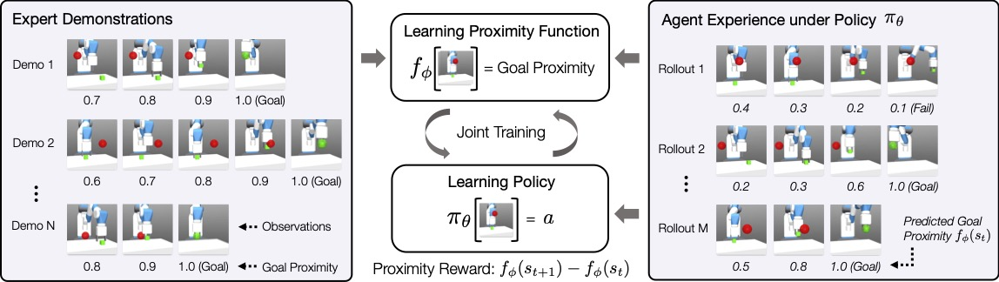
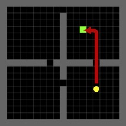
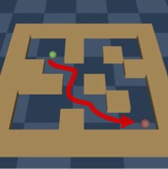
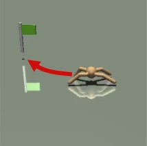
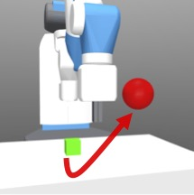
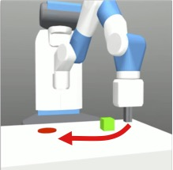
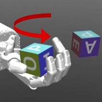
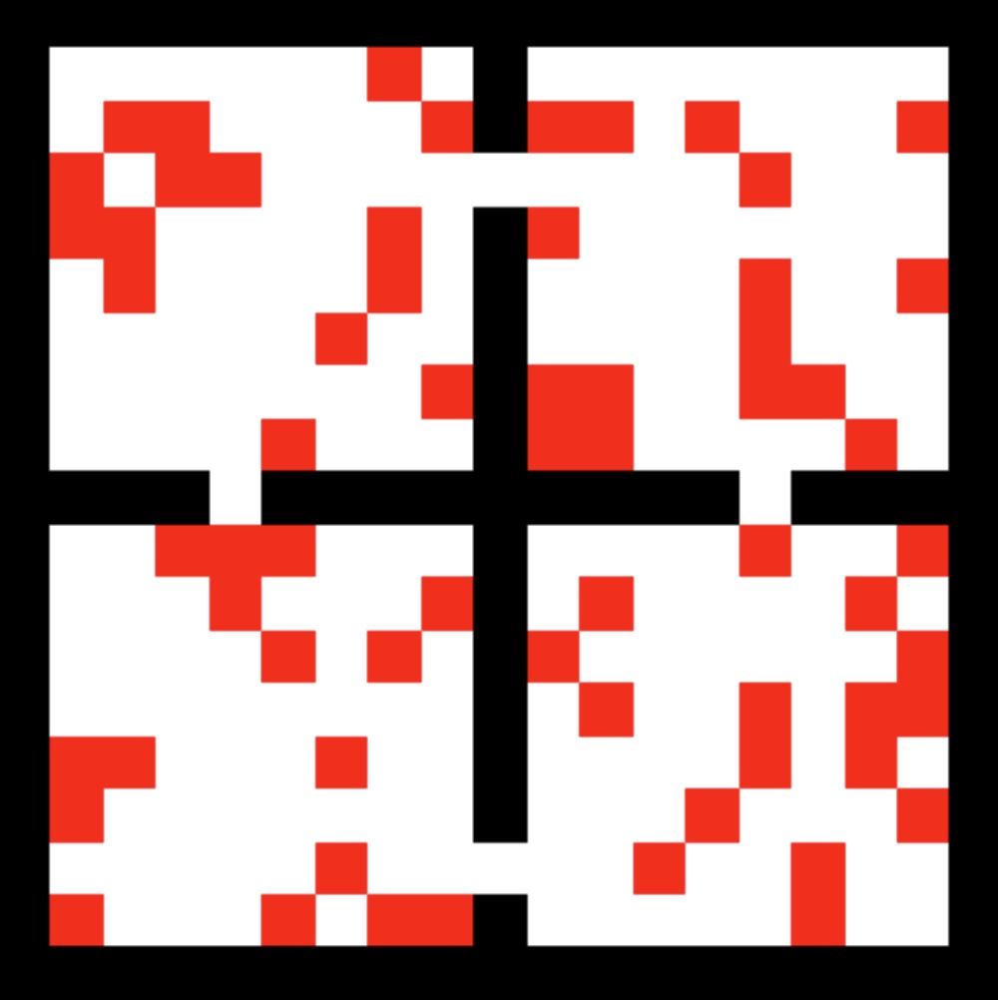
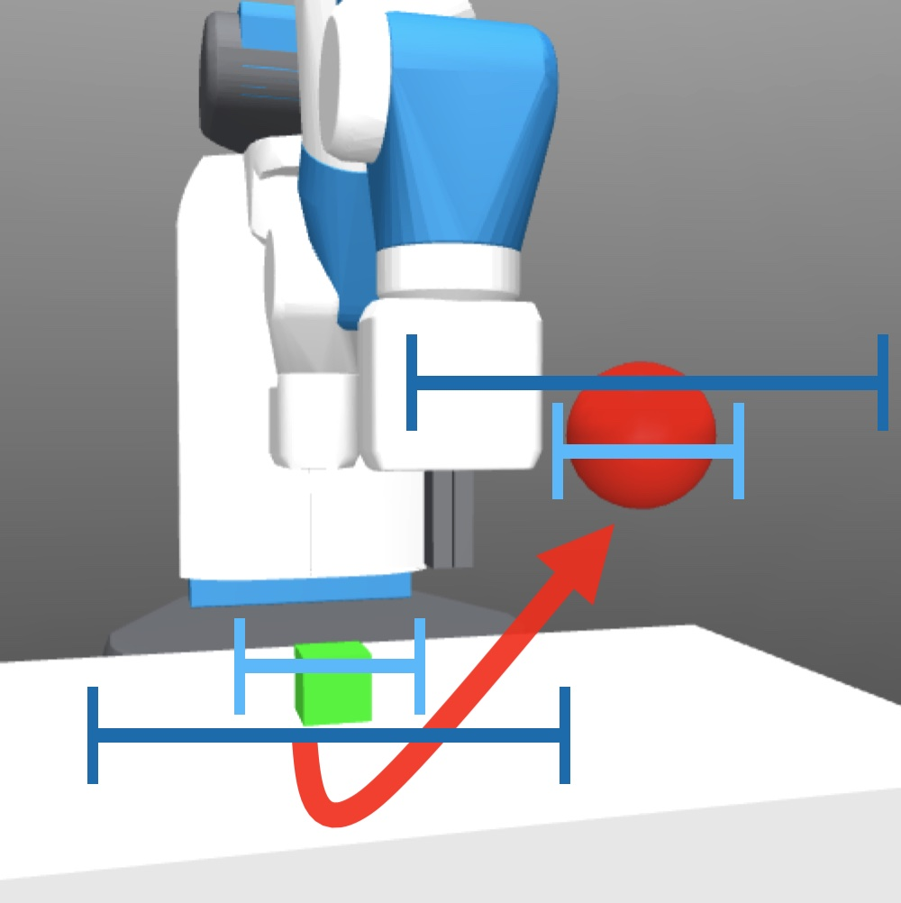

----

## Motivation

Humans imitate demonstrators performing a task by understanding the high-level task structure, instead of simply memorizing the demonstrator's low-level actions. This high-level task structure generalizes to new situations, and thus helps us to quickly learn the task in new situations. One intuitive and readily available instance of such high-level task structure from demonstrations is **task progress**, measuring how much of the task the agent completed. The task progress information can guide an agent closer to the goal. Inspired by this insight, we propose a novel imitation learning method that utilizes task progress for better generalization to unseen states and goals.


----


## Imitation Learning with Goal Proximity

In goal-directed tasks, states on an expert trajectory have increasing proximity toward the goal as the expert makes progress towards fulfilling a task. Inspired by this intuition, we propose to learn a proximity function **f** from expert demonstrations and agent experience, which predicts **goal proximity** (i.e. an estimate of temporal distance to the goal). Then, using this proximity function, we train a policy **&pi;** to progressively move to states with higher predicted goal proximity and eventually reach the goal. We alternate these two learning phases to improve both the proximity function and policy, leading to not only better generalization but also superior performance.





----


## Comparison to Prior Work: Adversarial Imitation Learning

<a href src="https://arxiv.org/abs/1606.03476" target="_blank">Adversarial</a> <a href src="https://arxiv.org/abs/1710.11248" target="_blank">imitation</a> <a href src="https://arxiv.org/abs/1807.06158" target="_blank">learning</a> methods encourage the agent to stay near the expert trajectories using a learned reward that distinguishes expert and agent behaviors. However, such learned reward functions often overfit to the expert demonstrations by learning spurious correlations between task-irrelevant features and expert/agent labels, and thus suffer from generalization to slightly different initial and goal configurations from the ones seen in the demonstrations (e.g. holdout goal regions or larger perturbation in goal sampling).

Unlike discriminating expert and agent behaviors by predicting **binary** labels in prior adversarial imitation learning methods, which is prone to overfitting to task-irrelevant features, our method learns more task-relevant information to precisely predict the task progress on a **continuous** scale. Hence, it can generalize better to unseen states and provide more informative rewards.


---


## Environments

<table>
<tbody>
  <tr style="border-bottom: none;">
    <td style="text-align: center">
        
    </td>
    <td style="text-align: center">
        
    </td>
    <td style="text-align: center">
        
    </td>
  </tr>
  <tr style="border-bottom: none;">
    <td style="text-align: center">
        <figcaption class="imgcaption" style="padding-top: 0px">Navigation</figcaption>
    </td>
    <td style="text-align: center">
        <figcaption class="imgcaption" style="padding-top: 0px">Maze2D</figcaption>
    </td>
    <td style="text-align: center">
        <figcaption class="imgcaption" style="padding-top: 0px">Ant Reach</figcaption>
    </td>
  </tr>
  <tr style="border-bottom: none;">
    <td style="text-align: center">
        
    </td>
    <td style="text-align: center">
        
    </td>
    <td style="text-align: center">
        
    </td>
  </tr>
  <tr style="border-bottom: none;">
    <td style="text-align: center">
        <figcaption class="imgcaption" style="padding-top: 0px">Fetch Pick</figcaption>
    </td>
    <td style="text-align: center">
        <figcaption class="imgcaption" style="padding-top: 0px">Fetch Push</figcaption>
    </td>
    <td style="text-align: center">
        <figcaption class="imgcaption" style="padding-top: 0px">Hand Rotate</figcaption>
    </td>
  </tr>
</tbody>
</table>


----


## Experimental Design

In our experiments, we focus on testing generalization capability of imitation learning approaches. So, across all tasks, we assume the expert demonstrations cover only a part of the state or goal space. This is often the case in the real world, such as (1) collecting a small number of demonstrations <span style="color: #CD5C5C;">sparsely covering initial and goal states</span>; or (2) collecting demonstrations in controlled environments with <span style="color: #85C1E9;">little noise</span>. Both of these cases require an imitation agent to generalize to unseen initial states and goal states.

<table>
<tbody>
  <tr style="border-bottom: none;">
    <td style="text-align: center">
        
    </td>
    <td style="text-align: center">
        
    </td>
  </tr>
  <tr style="border-bottom: none;">
    <td style="text-align: center">
        <figcaption class="imgcaption" style="padding-top: 0px">Case 1: Demonstrations cover <span style="color: #CD5C5C;">only part of the state space</span> </figcaption>
    </td>
    <td style="text-align: center">
        <figcaption class="imgcaption" style="padding-top: 0px">Case 2: <span style="color: #85C1E9;">Small expert sampling noise</span> vs. <span style="color: #2874A6;">Large agent sampling noise</span> </figcaption>
    </td>
  </tr>
</tbody>
</table>


----


## Quantitative Results

Our experiments show that the policy learned with the goal proximity function generalizes better than the state-of-the-art LfO algorithms on various goal-directed tasks, including navigation, locomotion, and robotic manipulation. Moreover, our method shows comparable results with LfD methods which learn from expert actions and a goal-conditioned imitation learning method which uses a sparse task reward.

")


----


## Exhaustive Results

To analyze how well our method and the baselines can generalize to unseen states, we vary the difference between the states encountered in expert demonstrations and agent training. If our method allows for greater generalization from the expert demonstrations, our method should perform well even under states different than those in the expert demonstrations.

The results of our method and baselines across varying degrees of generalization are shown below. Across both harder and easier generalization, our method demonstrates more consistent performance compared to baseline methods. While GAIfO-s performs well on high coverage or low noise, which require little generalization in agent learning, its performance deteriorates as the expert demonstration coverage decreases.

")


----


## Citation
```
@inproceedings{lee2021gpil,
  title={Generalizable Imitation Learning from Observation via Inferring Goal Proximity},
  author={Youngwoon Lee and Andrew Szot and Shao-Hua Sun and Joseph J. Lim},
  booktitle={Advances in Neural Information Processing Systems},
  year={2021}
}
```
<br>
